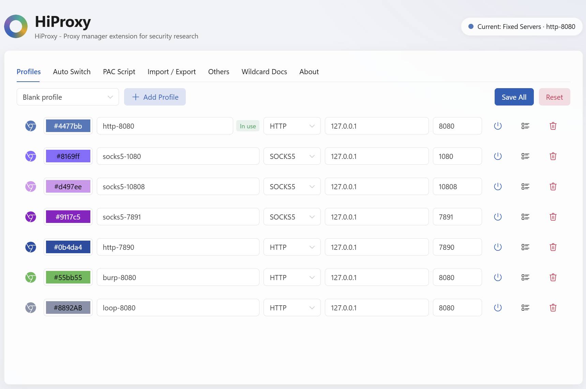

<div align="center">

# 🌐 HiProxy

**Browser proxy manager for security research (Chrome Manifest V3)**

Fully rewritten in v4 with Vue 3 + WXT + TypeScript and a Windows 11 (Fluent Design) UI,
carrying over everything from 3.x and adding **Auto Switch**, **PAC Script mode** and **Proxy Authentication**.

English | [简体中文](README.md)


</div>

---

## 📸 Screenshots



## ✨ Features

### Five proxy modes (one click in the popup)

| Mode | Description |
| --- | --- |
| 🔌 Direct | Bypass proxy, toolbar icon turns gray |
| 🖥 System | Follow the OS proxy settings, badge `SYS` |
| 🎯 Fixed Servers | Use a specific profile; the icon takes its color and the badge shows its name |
| 🔀 Auto Switch 🆕 | Domain rules pick the proxy automatically; rules are matched in order, first match wins |
| 📜 PAC Script 🆕 | Take over routing with a custom PAC script, entry function `FindProxyForURL(url, host)` |

### Profile management ("Profiles" tab)

- Visual per-row editing: **color icon + color swatch + name + scheme (HTTP/HTTPS/SOCKS4/SOCKS5) + host + port**
- Detail dialog: edit the **bypass host list** (one per line, wildcards supported) and **proxy authentication** (username/password)
- One-click "Set as active"; the active profile is tagged **"In use"**
- **Quick templates**: Burp Suite (8080) / HTTP (7890) / SOCKS5 (7891) / SOCKS5 (10808) / SOCKS5 (1080) / blank
- Batch save with inline validation (unique name, non-empty host, port 1–65535); invalid rows are highlighted in red

### Auto Switch (SwitchyOmega style) 🆕

- Rule list: **domain pattern → target** (direct / any profile), matched in order, first match wins
- Patterns follow SwitchyOmega semantics: `*.example.com` matches the apex plus all subdomains, `*` matches everything
- Configurable **default target** when nothing matches; changes apply **instantly** (debounced save)

### PAC Script 🆕

- Monospace code editor with Save / **Save & Enable** / Restore template / **Generate from auto-switch rules**
- Live validation of the `FindProxyForURL` entry function and the ASCII-only limit; invalid scripts fall back to Direct instead of breaking your network

### Import / Export & data migration

- Export `HiProxyConfig.json` containing every setting: profiles, auto-switch rules, PAC script…
- Import detects both the **new v2 format** and the **legacy 3.x format** (`Version: 319`) and upgrades old backups automatically
- One-click factory reset (keeps the "restore last proxy" switch)

### Toolbar state at a glance

- Dynamic ring icon colored by the active proxy (gray = direct, black = system, profile color, blue = AUTO, purple = PAC)
- Optional **mode badge** (`AUTO` / `PAC` / `SYS` / profile name) plus a live tooltip

### Proxy authentication

- HTTP/HTTPS proxy credentials are **filled in automatically** via `webRequest.onAuthRequired` — no manual prompt
- SOCKS5 authentication is a Chrome platform limitation; pair with the [HiLocalProxy](https://github.com/hicode0101) helper tool

### More

- 🪟 **Windows 11 (Fluent Design) UI**: Mica-style background, acrylic cards, top-down layout with feature tabs
- 🌍 **English & 简体中文 with a switchable UI language** (follow browser / English / 简体中文, change it in "Others"); 💾 **Versioned storage** (`schemaVersion`-driven, smooth migrations)
- ⌨️ 7 ready-made presets: Burp interception (common telemetry domains pre-bypassed), loopback interception (`<-loopback>`), and more

## 📦 Installation

### Option 1: Chrome Web Store

> Search for **HiProxy**, or grab a zip from [Releases](https://github.com/hicode0101/HiProxy/releases).

### Option 2: Load unpacked (developers)

1. Download and unzip `chrome.zip` (or build it yourself — see below)
2. Open `chrome://extensions` and enable **Developer mode**
3. Click **"Load unpacked"** and pick the unzipped folder

### Option 3: One-click packaging script (Windows)

Double-click **`package.bat`** in the project root — it checks pnpm, installs dependencies, builds, and produces `dist\hiproxy-<version>-chrome.zip`.

## 🛠 Development & build

```bash
pnpm install     # install dependencies (runs wxt prepare via postinstall)
pnpm dev         # dev mode with auto-open browser
pnpm build       # build chrome-mv3 into dist/chrome-mv3
pnpm zip         # build and create the release zip
pnpm compile     # vue-tsc type check
```

Stack: **Vue 3.5 + WXT 0.20 + TypeScript 5 + Naive UI (tree-shaken)**. Minimum Chrome version: 100.

**CI packaging**: A GitHub Actions workflow is included (`.github/workflows/release.yml`) — pushes to `main` run type check + build and upload the zip as a workflow artifact; pushing a `v*` tag (e.g. `v4.0.1`) automatically creates a GitHub Release with the zip attached.

## 🗂 Project layout

```
HiProxy/
├── entrypoints/
│   ├── background.ts        # Service worker: watches config changes → applies the proxy
│   ├── options/             # Options page (top-down layout, 7 feature tabs)
│   │   └── tabs/            # Profiles / Auto Switch / PAC Script / Import-Export / Others / Wildcard docs / About
│   └── popup/               # Quick-switch menu (Win11 acrylic style)
├── components/              # Shared components (profile detail dialog, …)
├── composables/useConfig.ts # Global config state: load / draft updates / cross-context sync
├── types/                   # Domain types (ProxyProfile / ExtensionConfig / backup formats)
├── utils/
│   ├── config/              # Defaults / validation / legacy migration / load-save facade
│   ├── proxy/               # Proxy engine / PAC generator / icon & badge / auth
│   ├── storage.ts           # Thin storage.local wrapper (single root key + watch)
│   └── object.ts / i18n.ts  # deepClone (avoids the structuredClone pitfall) / i18n helper
└── public/_locales/         # en / zh_CN messages
```

## 🏗 Architecture notes

- **Event-driven single writer**: UI only writes config → `storage.watch` → the background applies proxy / icon / auth cache in one place, eliminating state drift
- **Stable UUIDs**: profiles are identified by UUID, decoupled from their display name — renaming no longer silently drops the active proxy
- **Sanitize on write**: data from any source (import / migration / manual) passes through `sanitizeConfig`; dangling references fall back to Direct
- **Versioned storage**: a `schemaVersion`-driven migration chain, backwards compatible with legacy 3.x data

## 🔐 Permissions

| Permission | Why it's needed |
| --- | --- |
| `proxy` | Read/write browser proxy settings (core feature) |
| `storage` | Persist configuration locally |
| `webRequest` + `webRequestAuthProvider` | Listen for proxy auth challenges and auto-fill credentials |
| `host_permissions: <all_urls>` | Required by MV3 so `onAuthRequired` covers every site |

The extension **collects and uploads nothing** — all settings stay in your local browser.

## ❓ FAQ

- **SOCKS5 username/password auth?** Chrome's `onAuthRequired` does not cover SOCKS. Use the HiLocalProxy helper for local forwarding; HTTP/HTTPS proxy auth is natively supported.
- **PAC script save fails with a non-ASCII error?** Chrome requires PAC content to be ASCII only — remove Chinese comments before saving (the page warns you live).
- **How do I verify the proxy is active?** The toolbar icon changes color and the badge updates as soon as a config applies; you can also check your exit IP on any IP-echo site.

## 👨‍💻 Author

**犀利的远哥 (hicode0101)** — security researcher / white hat

| 💬 WeChat | 📢 Official account |
| :---: | :---: |
|  |  |

Questions and feature requests are always welcome.

## 📜 Disclaimer

> These tools are intended **for white-hat security research and technical exchange only. Commercial use is prohibited.**
