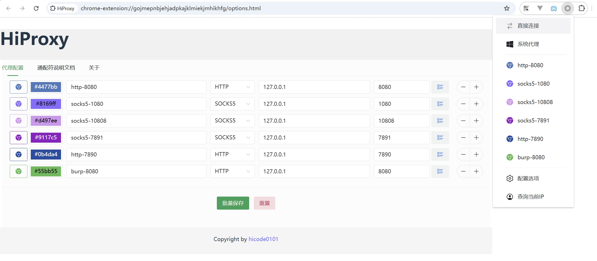
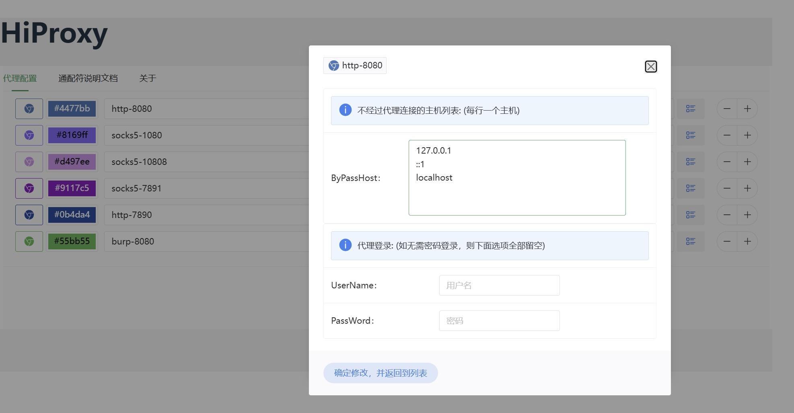

# HiProxy
A proxy extension for Chrome

```
Based on Manifest V3 （MV3）

vue3 + wxt + ts


全新版本，基于谷歌扩展MV3规范开发，适用于Chrome浏览器新版本。

代码框架采用 vue3 + wxt + ts


项目代码完全开源，有兴趣的可以自己尝试编译打包，或者省事的师傅可以直接下载我打包好的 zip 文件，直达下载地址：

https://github.com/hicode0101/HiProxy/releases


使用方式：
1、进chrome 浏览器扩展，直达地址 chrome://extensions/
2、开启开发者模式
3、把下载的 HiProxy-3.1.5-chrome.zip 文件直接拖进去，就可以了，不用解压。


B站 安装和使用视频教程：
https://www.bilibili.com/video/BV1tVS4YXEUT

```

# Screenshot（UI截图）







