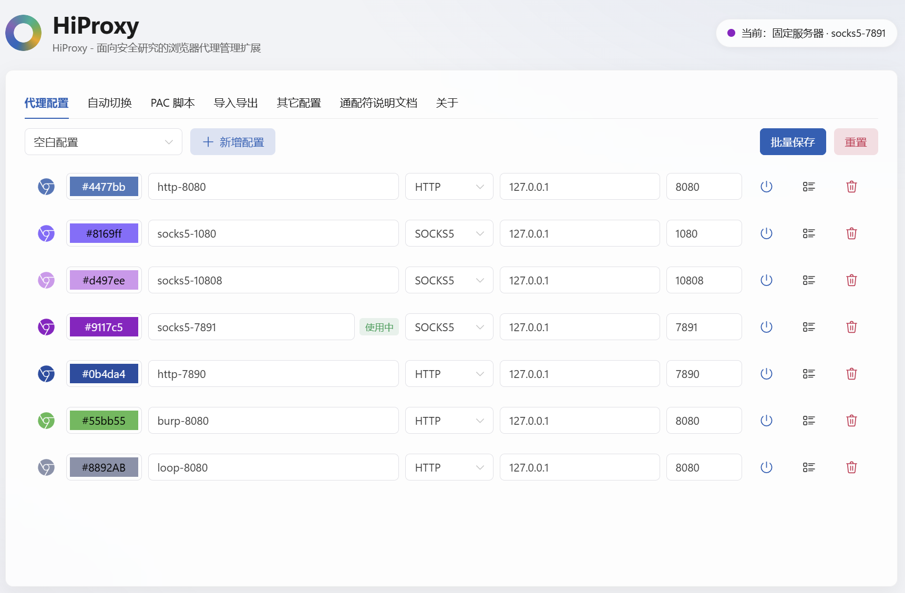

<div align="center">

# 🌐 HiProxy

**用于Chrome浏览器的代理管理扩展（Chrome Manifest V3）**

全新 v4 重写：Vue 3 + WXT + TypeScript，Win11 (Fluent Design) 风格界面，
在 3.x 全部能力之上新增 **自动切换**、**PAC 脚本模式** 与 **代理认证**。

[English](README.en-US.md) | 简体中文


</div>

---

## 📸 界面预览



## ✨ 功能特性

### 五种工作模式（Popup 一键切换）

| 模式 | 说明 |
| --- | --- |
| 🔌 直接连接 | 关闭代理，工具栏图标变灰 |
| 🖥 系统代理 | 跟随操作系统代理设置，徽标 `SYS` |
| 🎯 固定服务器 | 使用某个代理配置，图标变为该配置的颜色，徽标显示配置名 |
| 🔀 自动切换 🆕 | 按域名规则自动选择代理，规则按顺序匹配、先命中先生效 |
| 📜 PAC 脚本 🆕 | 完全自定义 PAC 脚本接管分流，入口函数 `FindProxyForURL(url, host)` |

### 代理配置管理（「代理配置」Tab）

- 每行可视化编辑：**配置色图标 + 颜色块 + 名称 + 协议（HTTP/HTTPS/SOCKS4/SOCKS5）+ 主机 + 端口**
- 详情弹窗：编辑 **bypass 主机列表**（每行一个，支持通配符）与 **代理认证**（用户名/密码）
- 「设为当前」一键启用；当前使用的配置带 **「使用中」** 标记
- **快速模板**：Burp Suite (8080) / HTTP (7890) / SOCKS5 (7891) / SOCKS5 (10808) / SOCKS5 (1080) / 空白
- 批量保存 + 行内校验（名称唯一、host 非空、端口 1~65535），非法行红框提示

### 自动切换 🆕

- 规则列表：**域名表达式 → 目标**（直连 / 任意代理配置），按顺序匹配
- 表达式语义：`*.example.com` 匹配主域与全部子域名、`*` 匹配所有
- 可设置未命中时的**默认走向**；修改**即时生效**（防抖保存）

### PAC 脚本 🆕

- 等宽字体代码编辑器，支持保存 / **保存并启用** / 恢复默认模板 / **由自动切换规则一键生成**
- 实时校验 `FindProxyForURL` 入口函数与 ASCII 字符限制，脚本异常时自动回退直连不会断网

### 导入导出与数据迁移

- 导出 `HiProxyConfig.json`（含配置、自动切换规则、PAC 脚本等全部设置）
- 导入自动识别 **新版 v2 格式**与**旧版 3.x 格式**（`Version: 319`），旧配置自动升级
- 一键重置出厂默认（保留"恢复上次代理"开关）

### 工具栏状态可视化

- 动态圆环图标随当前代理**变色**（直连灰 / 系统黑 / 配置色 / AUTO 蓝 / PAC 紫）
- 可关闭的**模式徽标**（`AUTO` / `PAC` / `SYS` / 配置名）与实时 tooltip

### 代理认证

- HTTP/HTTPS 代理的 **用户名密码自动回填**（`webRequest.onAuthRequired`），无需手动弹窗输入
- SOCKS5 认证受 Chrome 平台限制，请配合 [HiLocalProxy](https://github.com/hicode0101) 小工具使用

### 更多

- 🪟 **Win11 (Fluent Design) 界面**：Mica 质感背景、亚克力卡片、上下布局 + 功能选项卡
- 🌍 **中英双语，界面语言可切换**（跟随浏览器语言 / English / 简体中文，在「其它配置」中修改）；💾 **结构化存储**（`schemaVersion` 驱动，可平滑迁移）
- ⌨️ 7 个预设场景配置开箱即用：Burp 抓包（已排除常见遥测域名）、本地回环抓包（`<-loopback>`）等

## 📦 安装

### 方式一：Chrome Web Store

> 直接访问ChromeStore上的 [HiProxy](https://chromewebstore.google.com/detail/hiproxy/ammmjkfjeahfkfffncemmbpfdboclfah) 进行在线安装。

### 方式二：本地加载（开发者）

1. 下载 [`chrome.zip`](https://github.com/hicode0101/HiProxy/releases) 并解压（或自行构建，见下文）
2. 打开 `chrome://extensions`，开启右上角 **开发者模式**
3. 点击 **「加载已解压的扩展程序」**，选择解压后的目录

### 方式三：一键打包脚本（Windows）

双击项目根目录的 **`package.bat`**，自动完成：检查 pnpm → 安装依赖 → 构建 → 生成 `dist\hiproxy-<版本>-chrome.zip`。

## 🛠 开发与构建

```bash
pnpm install     # 安装依赖（postinstall 自动执行 wxt prepare）
pnpm dev         # 开发模式，自动打开浏览器
pnpm build       # 构建 chrome-mv3 到 dist/chrome-mv3
pnpm zip         # 构建并生成发布 zip
pnpm compile     # vue-tsc 类型检查
```

技术栈：**Vue 3.5 + WXT 0.20 + TypeScript 5 + Naive UI（按需引入）**，最低支持 Chrome 100。

**CI 自动打包**：仓库内置 GitHub Actions（`.github/workflows/release.yml`）——推送到 `main` 自动类型检查、构建并上传 zip 产物；推送 `v*` 标签（如 `v4.0.1`）会自动创建 GitHub Release 并附上对应 zip。

## 🗂 目录结构

```
HiProxy/
├── entrypoints/
│   ├── background.ts        # Service Worker：监听配置变化 → 统一应用代理
│   ├── options/             # 选项页（上下布局 + 7 个功能 Tab）
│   │   └── tabs/            # 代理配置 / 自动切换 / PAC 脚本 / 导入导出 / 其它配置 / 通配符文档 / 关于
│   └── popup/               # Popup 快捷切换菜单（Win11 亚克力风格）
├── components/              # 跨页面组件（配置详情弹窗等）
├── composables/useConfig.ts # 全局配置状态：加载 / 草稿修改 / 跨上下文同步
├── types/                   # 领域类型（ProxyProfile / ExtensionConfig / 备份格式）
├── utils/
│   ├── config/              # 默认配置 / 校验 / 旧版迁移 / 加载保存门面
│   ├── proxy/               # 代理引擎 / PAC 生成 / 图标徽标 / 代理认证
│   ├── storage.ts           # storage.local 薄封装（单一根键 + watch）
│   └── object.ts / i18n.ts  # 深拷贝（避开 structuredClone 坑）/ 多语言助手
└── public/_locales/         # en / zh_CN 文案
```

## 🏗 架构要点

- **事件驱动单一出口**：UI 只负责写配置 → `storage.watch` → background 统一应用代理 / 图标 / 认证缓存，杜绝多处直调导致的状态漂移
- **稳定 UUID**：配置以 UUID 为身份、与名称解耦，重命名不再导致"当前代理"静默丢失
- **写入即修复**：任何来源的数据（导入 / 迁移 / 手工）先过 `sanitizeConfig`，引用悬空自动回退直连
- **版本化存储**：`schemaVersion` 驱动的迁移链，向后兼容旧版 3.x 数据

## 🔐 权限说明

| 权限 | 用途 |
| --- | --- |
| `proxy` | 读写浏览器代理设置（核心能力） |
| `storage` | 本地保存配置 |
| `webRequest` + `webRequestAuthProvider` | 监听代理认证质询并自动回填凭据 |
| `host_permissions: <all_urls>` | MV3 下 `onAuthRequired` 覆盖全部站点所必需 |

扩展**不采集、不上传任何数据**，全部配置仅保存在本地浏览器中。

## ❓ 常见问题

- **SOCKS5 用户名密码认证？** Chrome 的 `onAuthRequired` 不覆盖 SOCKS，请使用 HiLocalProxy 本地转发；HTTP/HTTPS 代理认证已原生支持。
- **PAC 脚本保存报非 ASCII 错误？** Chrome 要求 PAC 内容仅含 ASCII 字符，请移除中文注释后再保存（页面会实时提示）。
- **如何确认代理已生效？** 工具栏图标变色 / 徽标变化即代表配置已应用；也可访问任意 IP 检测网站核验出口 IP。

## 👨‍💻 关于作者

**犀利的远哥（hicode0101）** — 白帽子安全研究者

| 💬 微信 | 📢 公众号 |
| :---: | :---: |
|  |  |

使用中遇到问题欢迎联系，功能需求也请告知。

## 📜 声明

> 本系列工具软件**仅供白帽子安全研究和技术交流使用，禁止用于商业用途**。
