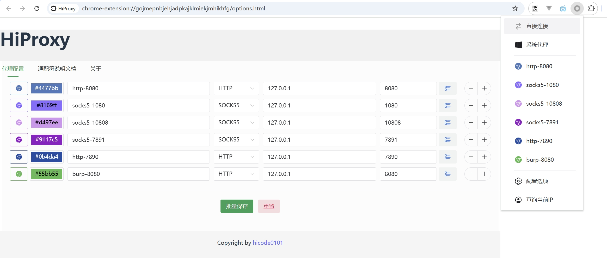
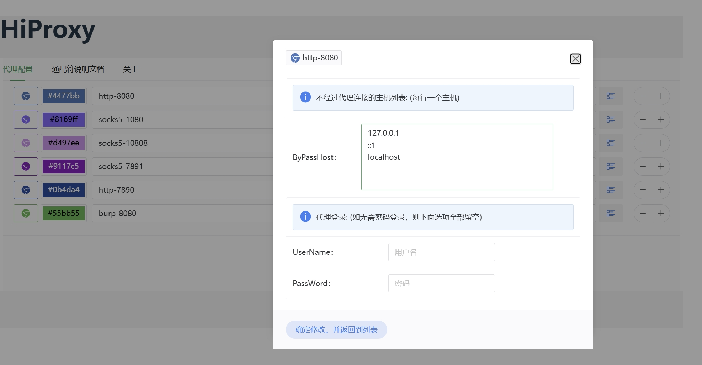

# 🌐 HiProxy

**一款基于 Chrome Manifest V3 的浏览器代理管理扩展**

全新架构重写，适配 Chrome 新版本，代码完全开源。

[⬇️ 下载安装包](https://github.com/hicode0101/HiProxy/releases) · [🛒 Chrome 商店](https://chromewebstore.google.com/detail/hiproxy/ammmjkfjeahfkfffncemmbpfdboclfah) · [🎬 视频教程](https://www.bilibili.com/video/BV1tVS4YXEUT)

---

## ✨ 特性

- 🚀 **全新版本** — 基于谷歌扩展 MV3 规范开发，适用于 Chrome 浏览器新版本
- 🧱 **现代技术栈** — 采用 `Vue3 + WXT + TypeScript` 构建
- 🔓 **完全开源** — 可自行编译打包，也可直接下载现成的 zip 安装
- 🧦 **SOCKS5 带认证支持** — 配合同作者的 **HiLocalProxy** 小工具，完美解决主流浏览器不支持 SOCKS5 用户名密码验证的问题

---

## 📥 安装

### 方式一：Chrome 商店（推荐国际用户）

> 直达 Chrome Web Store 安装：<https://chromewebstore.google.com/detail/hiproxy/ammmjkfjeahfkfffncemmbpfdboclfah>

### 方式二：本地导入 zip 包

1. 从 [Releases](https://github.com/hicode0101/HiProxy/releases) 下载 `HiProxy-3.2.10-chrome.zip`
2. 打开 Chrome 扩展管理页：`chrome://extensions/`
3. 开启右上角的 **开发者模式**
4. 将 zip 文件 **直接拖入** 页面即可，无需解压

---

## 🎬 视频教程

| 教程 | 链接 |
| --- | --- |
| 插件安装和使用 | [Bilibili 观看](https://www.bilibili.com/video/BV1tVS4YXEUT) |
| SOCKS5 用户名密码代理配置 | [Bilibili 观看](https://www.bilibili.com/video/BV18rPsedEXs) |

---

## 📸 界面截图

| | |
| --- | --- |
|  |  |

---

## 👨‍💻 关于作者

**犀利的远哥** — 白帽子安全研究者

| | |
| --- | --- |
| 💬 微信 | `hicode0101` |
| 📢 公众号 | 远哥说安全 |

| 个人微信 | 微信公众号 |
| :---: | :---: |
|  |  |

使用中遇到问题欢迎联系我，我会及时回复；如有功能需求，也请告知，我非常乐意尝试满足。

---

## 📜 声明

> 本系列工具软件**仅供白帽子安全研究和技术交流使用，禁止用于商业用途**。
